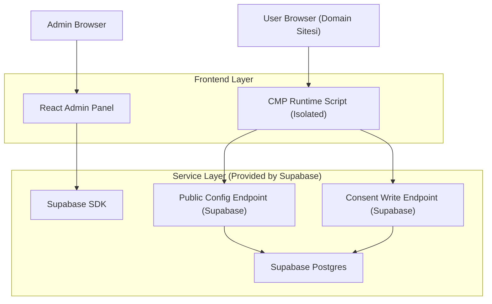
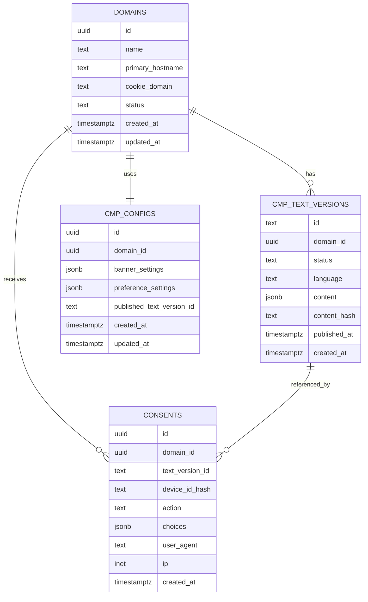

## 1.Architecture design


**İzolasyon ilkeleri (Vion/Omni akışlarını etkilememek için):**
- CMP runtime scripti asenkron yüklenir (ör. `defer`/`async`); yüklenemezse UI hiç render edilmez ve sayfa çalışmaya devam eder.
- Runtime; Vion/Omni global değişkenlerine dokunmaz, kendi namespace’inde çalışır.
- Runtime; sadece kendi cookie/localStorage anahtarlarını kullanır; çakışmayı önlemek için prefix uygulanır (örn. `cmp_`).

## 2.Technology Description
- Frontend (Admin): React@18 + TypeScript + vite + tailwindcss@3
- Frontend (Runtime): TypeScript ile build edilen tek JS bundle (UMD/IIFE), CSS minimal
- Backend: Supabase (Auth + Postgres + (opsiyonel) Edge Functions)

## 3.Route definitions
| Route | Purpose |
|-------|---------|
| /login | Yönetici girişi |
| /domains | Domain listesi + snippet görüntüleme |
| /domains/:domainId | Banner/tercih ayarları + metin sürümleme |
| /consents | Rıza kayıtları listeleme + export |

## 6.Data model(if applicable)

### 6.1 Data model definition


**Kapsam notları (domain, banner/tercihler, metin sürümleme, rıza kayıtları):**
- Domain: birincil hostname + (opsiyonel) cookie domain (`.example.com`) ve statü (active/paused).
- Banner/Tercihler: JSON ayarları (UI teması, buton metinleri, kategoriler, yeniden gösterim politikası).
- Metin sürümleme: domain + dil bazında taslak/yayın sürümleri, yayınlı sürüm ID’si config’te tutulur.
- Rıza kayıtları: her event; domain + kullanılan metin sürümü + tercih seçimlerini (JSON) içerir.

### 6.2 Data Definition Language
**domains**
```sql
CREATE TABLE domains (
  id UUID PRIMARY KEY DEFAULT gen_random_uuid(),
  name TEXT NOT NULL,
  primary_hostname TEXT NOT NULL,
  cookie_domain TEXT,
  status TEXT NOT NULL DEFAULT 'active',
  created_at TIMESTAMPTZ NOT NULL DEFAULT now(),
  updated_at TIMESTAMPTZ NOT NULL DEFAULT now()
);

CREATE UNIQUE INDEX idx_domains_primary_hostname ON domains(primary_hostname);
```

**cmp_configs**
```sql
CREATE TABLE cmp_configs (
  id UUID PRIMARY KEY DEFAULT gen_random_uuid(),
  domain_id UUID NOT NULL,
  banner_settings JSONB NOT NULL DEFAULT '{}'::jsonb,
  preference_settings JSONB NOT NULL DEFAULT '{}'::jsonb,
  published_text_version_id TEXT,
  created_at TIMESTAMPTZ NOT NULL DEFAULT now(),
  updated_at TIMESTAMPTZ NOT NULL DEFAULT now()
);

CREATE UNIQUE INDEX idx_cmp_configs_domain_id ON cmp_configs(domain_id);
```

**cmp_text_versions**
```sql
CREATE TABLE cmp_text_versions (
  id TEXT PRIMARY KEY,
  domain_id UUID NOT NULL,
  status TEXT NOT NULL DEFAULT 'draft',
  language TEXT NOT NULL DEFAULT 'tr',
  content JSONB NOT NULL,
  content_hash TEXT NOT NULL,
  published_at TIMESTAMPTZ,
  created_at TIMESTAMPTZ NOT NULL DEFAULT now()
);

CREATE INDEX idx_cmp_text_versions_domain_id ON cmp_text_versions(domain_id);
CREATE INDEX idx_cmp_text_versions_status ON cmp_text_versions(status);
```

**consents**
```sql
CREATE TABLE consents (
  id UUID PRIMARY KEY DEFAULT gen_random_uuid(),
  domain_id UUID NOT NULL,
  text_version_id TEXT,
  device_id_hash TEXT,
  action TEXT NOT NULL, -- accept_all | reject_all | save_preferences | withdraw
  choices JSONB NOT NULL, -- kategori bazlı seçimler
  user_agent TEXT,
  ip INET,
  created_at TIMESTAMPTZ NOT NULL DEFAULT now()
);

CREATE INDEX idx_consents_domain_id_created_at ON consents(domain_id, created_at DESC);
CREATE INDEX idx_consents_text_version_id ON consents(text_version_id);
```

**Yetki ve RLS (önerilen minimum)**
```sql
-- Public okuma: yayınlı config ve metinler
GRANT SELECT ON domains TO anon;
GRANT SELECT ON cmp_configs TO anon;
GRANT SELECT ON cmp_text_versions TO anon;

-- Public yazma: sadece rıza insert
GRANT INSERT ON consents TO anon;

-- Yönetici: tüm yetkiler
GRANT ALL PRIVILEGES ON domains TO authenticated;
GRANT ALL PRIVILEGES ON cmp_configs TO authenticated;
GRANT ALL PRIVILEGES ON cmp_text_versions TO authenticated;
GRANT ALL PRIVILEGES ON consents TO authenticated;

-- RLS aç
ALTER TABLE domains ENABLE ROW LEVEL SECURITY;
ALTER TABLE cmp_configs ENABLE ROW LEVEL SECURITY;
ALTER TABLE cmp_text_versions ENABLE ROW LEVEL SECURITY;
ALTER TABLE consents ENABLE ROW LEVEL SECURITY;

-- Örnek politika yaklaşımları (özet):
-- 1) anon için domains/cmp_configs/cmp_text_versions SELECT: sadece status=active ve published olanlar
-- 2) anon için consents INSERT: serbest; SELECT yasak
```

> Not: Fiziksel foreign key constraint kullanılmadan (application-level ilişki) ilerlenir; ilişkiler `domain_id` / `text_version_id` alanlarıyla mantıksal kurulur.
