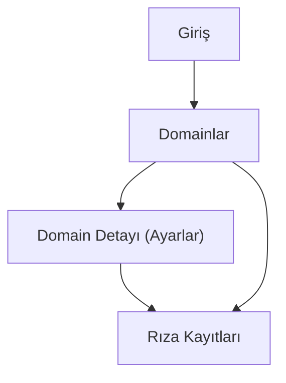

## 1. Product Overview
CMP (Cookie Management Platform) ile farklı domain’lerde çerez banner’ı ve tercih yönetimini merkezi olarak kurgular, rıza kayıtlarını versiyonlu metinlerle birlikte tutarsın. CMP; AmeritAI ve Omni akışlarını etkilemeden, bağımsız (izole) çalışacak şekilde tasarlanır.

## 2. Core Features

### 2.1 User Roles
| Rol | Registration Method | Core Permissions |
|------|---------------------|------------------|
| Yönetici (Admin) | Supabase Auth (e-posta/şifre veya kurum içi SSO) | Domain ekleme/düzenleme, banner/tercih ayarları, metin versiyon yayınlama, rıza kayıtlarını görüntüleme/dışa aktarma |
| Ziyaretçi (End-user) | Kayıt yok | Banner görüntüleme, tercih verme/değiştirme, rızayı geri çekme |

### 2.2 Feature Module
Uygulama aşağıdaki ana sayfalardan oluşur:
1. **Giriş**: yönetici oturumu açma.
2. **Domainlar**: domain listesi, CMP snippet bilgisi, hızlı durum görünümü.
3. **Domain Detayı (Ayarlar)**: banner/tercihler, metin sürümleme (taslak/yayın), yayın durumu.
4. **Rıza Kayıtları**: filtreleme, görüntüleme, dışa aktarma.

### 2.3 Page Details
| Page Name | Module Name | Feature description |
|-----------|-------------|---------------------|
| Giriş | Kimlik doğrulama | Oturum aç. • Şifre sıfırlama akışı (opsiyonel, minimum). |
| Domainlar | Domain yönetimi | Domain ekle/düzenle/pasifleştir. • Domain’e bağlı ortam (prod/stage) ve hostname listesi yönet. |
| Domainlar | Entegrasyon (CMP snippet) | Kopyalanabilir script etiketi göster. • Entegrasyonun “izole çalışma” notlarını ve doğrulama adımlarını göster (asenkron yükleme, hata toleransı). |
| Domain Detayı (Ayarlar) | Banner & Tercihler | Banner türü (alt bar/center modal), görünüm (renk/tema), varsayılan dil, yeniden gösterim politikası (örn. X gün sonra). • Kategori bazlı tercih (Zorunlu/Analitik/Pazarlama) aç-kapa. • “Tercihler” ekranına link/ikincil buton ayarla. |
| Domain Detayı (Ayarlar) | Metin sürümleme | Banner ve tercih metinlerini sürümle (v1, v2…). • Taslak oluştur, yayınla, geri al/önceki sürüme dön. • Yayınlanan sürümün hash/ID bilgisini üret. |
| Domain Detayı (Ayarlar) | Domain kapsamı (scope) | Domain’e bağlı cookie alan adı kuralını tanımla (ör. .example.com). • Uygulanacak path/alt alan adı kapsamını belirle. |
| Rıza Kayıtları | Log görüntüleme | Domain’e göre filtrele. • Tarih aralığı filtrele. • Seçilen tercihleri ve kullanılan metin sürümü ID’sini görüntüle. |
| Rıza Kayıtları | Dışa aktarma | CSV/JSON export al (minimum: CSV). • Export’ın sadece yöneticiye açık olmasını sağla. |

## 3. Core Process
**Yönetici Akışı**
1. Giriş yaparsın.
2. Domain eklersin; sistem sana ilgili domain için CMP snippet’ini verir.
3. Domain detayında banner/tercih ayarlarını yaparsın.
4. Metinleri taslak olarak düzenler, yayınlarsın (yayınlanan sürüm ID’si oluşur).
5. Domain sitesinde CMP scripti asenkron yüklenir; banner ve tercihler bu yayınlı sürüme göre görünür.
6. Rıza kayıtlarını listeler, gerektiğinde dışa aktarırsın.

**Ziyaretçi Akışı**
1. Siteye girer; CMP scripti izole şekilde yüklenir (yüklenemezse site akışı bozulmaz).
2. Banner üzerinden kabul/ret/tercihleri yönetir.
3. Seçimleri kaydedilir; kayıt, yayınlı metin sürümü ile ilişkilendirilir.
4. Ziyaretçi daha sonra tercihlerden rızasını değiştirebilir/geri çekebilir.

